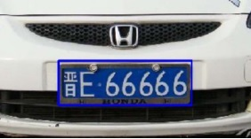
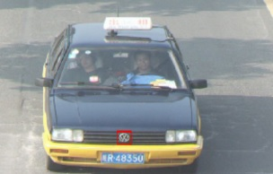
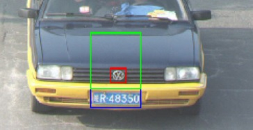

## 基于python-opencv的车标定位与识别  
### 环境：python2.7+opencv3.2.0
### 代码说明：
#### 定位模块：location.py 
1. 定位车牌：在HSV下过滤蓝色-->边缘检测，腐蚀膨胀-->查找轮廓（满足长宽比和面积要求）  
2. 粗定位车标：根据定位出的车牌和车标相对位置，可大致定位车标范围  
3. 二次定位车标：对粗定位的车标范围进行二值化、边缘检测、形态学等操作以剔除背景再使用opencv函数查找轮廓，  
取满足要求的最大轮廓即为车标区域，将其存储在logo2.jpg  
#### 特征提取模块：recognition.py 
1. 采用LBP作为特征进行车标识别，分别实现了基本3x3LBP、圆形LBP以及uniform LBP。 
2. 使用圆形LBP。首先提取图像LBP，然后计算其LBPH（LBP的统计直方图）作为特征向量。 
#### 主模块：main.py
logo template文件夹下为训练用的车标模板，共七类，每一类30张车标图像。vehicle文件夹下为用于定位的卡口车辆图像。 
1. 建立特征库：读取每一类下车标图像，求LBPH后取平均值作为该类车标的特征向量。
使用两个列表分别保存每一类车标的特征向量和对应的类别标签，将其使用python对象 。
持久化到feature.dat文件中，下次直接载入即可。 
2. 预测：读取待识别车标（logo2.jpg)，计算其LBPH，利用opencv直方图匹配函数将其与每一类的车标特征向量进行比较，最相似的即为该车标对应的类别

### 结果展示
#### 车牌定位结果：

#### 车标定位结果：

#### 最终结果：

#### 参考资料：
 LBP原理及实现：http://blog.csdn.net/quincuntial/article/details/50541815  
 python-opencv：http://docs.opencv.org/trunk/d6/d00/tutorial_py_root.html  
